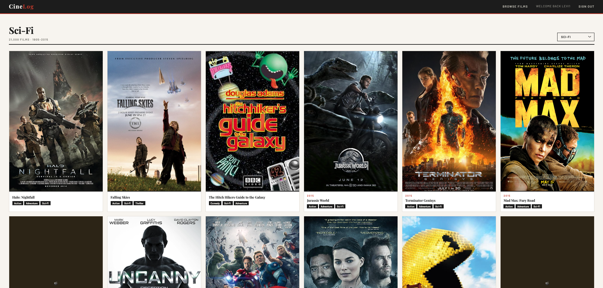

# CineLog 🎬

## Description

CineLog is a social platform for classic film enthusiasts. Browse over 21,000 films from 1905 to 2015, write reviews and personal experiences, and engage with other cinephiles through comments.

Whether you're a lifelong fan of silent films or just discovering the golden age of Hollywood, CineLog gives you a place to share your thoughts and connect with others who share your passion.

## Getting Started

- 🌐 [Live App](https://cinelog81.netlify.app/)
- 📋 [Planning Materials](https://trello.com/b/GrnrEK2L)
- 🗄️ [Back-end Repository](https://github.com/levi81770/Cine-Log-Back-End)

## Technologies Used

- **Front-end:** React, React Router, CSS
- **Back-end:** Node.js, Express
- **Database:** MongoDB, Mongoose
- **Authentication:** JWT (JSON Web Tokens), bcrypt
- **Fonts:** Google Fonts (Playfair Display, Barlow)
- **Deployment:** 

## Attributions

- [MongoDB Sample Mflix Dataset](https://www.mongodb.com/docs/atlas/sample-data/sample-mflix/) — 21,000 classic films dataset
- [Google Fonts](https://fonts.google.com/) — Playfair Display & Barlow typefaces

## Next Steps

- 🔍 Search films by title
- ⭐ Rate films from 1 to 5 stars in posts
- 👤 User profile pages showing all posts by a user
- ❤️ Like other users' posts
- 🎭 Filter films by decade
- ✏️ Edit and delete comments